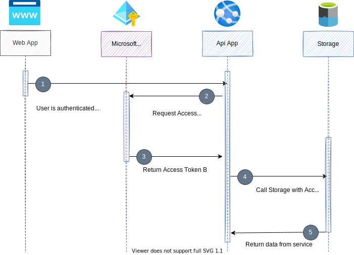

# OAuth2 OBO Flow - On-behalf-of Flow in DotNet

Showcasing an Azure AD On-Behalf-Of (OBO) OAuth2 Flow.

When an api doesn't own its resources or the access to those, it is sometime handy to be able to forward the request down to the next application on behalf of the user (OAUTH2 OBO Flow). This way the api doesn't need to know what access this user/application has to this api's underlying resources. Some good examples are if the underlying resources are protected by Azure AD, like Azure Sql Server or Azure Data Lake with RBAC (Role Based Access) or ACL (Access Control Lists)



**NOTE:**

* All steps below are executed from the root folder (the same folder as this README file)
  
## Create shared Azure Resources

> Upgrade `az cli` with `az upgrade`, since some validation lies within the tool itself.

```Powershell

# Run login first, so you can see your subscriptions
az login

# List your Azure subscription in a more readable manner
az account list --query "[].{name:name, subscriptionId:id}"

# ##################################################################
# Set your variables
# ##################################################################
# Set you Azure Subscription name and preferred resource location
# ------------------------------------------------------------------
$subscriptionName      = "<YOUR_AZURE_SUBSCRIPTION_NAME>"
$location              = "westeurope"
$myDemoNamePrefix      = "oauth2-obo-flow-demo"
$myDemoNamePrefixShort = $myDemoNamePrefix -replace "-"

# Setting variables
$rand               = Get-Random -Minimum 10 -Maximum 99
$resourceGroup      = "$myDemoNamePrefix-rg-$rand"
$storageAccountName = "${myDemoNamePrefixShort}st$rand"
$logWorkspaceName   = "${myDemoNamePrefix}-log-$rand"
$appInsightsName    = "${myDemoNamePrefix}-appi-$rand"
$appPlanName        = "${myDemoNamePrefix}-app-plan-$rand"

$apiAppName      = "${myDemoNamePrefix}-api-app-$rand"
$apiAppMsi       = "${myDemoNamePrefix}-api-msi-$rand"
$apiAppLocalUrl  = "https://localhost:7050"
$apiAppPublicUrl = "https://$apiAppName.azurewebsites.net"


$webAppName      = "${myDemoNamePrefix}-web-app-$rand"
$webAppMsi       = "${myDemoNamePrefix}-web-msi-$rand"
$webAppLocalUrl  = "https://localhost:7051"
$webAppPublicUrl = "https://$webAppName.azurewebsites.net"


# Then set the subscription name explicitly.
az account set -s "$subscriptionName"

# Verify that you set the correct subscription
az account show

az group create -n $resourceGroup -l $location

# Create storage account. Be patient, this could take some seconds.
az storage account create `
  -n $storageAccountName `
  -l $location `
  -g $resourceGroup `
  --sku Standard_LRS `
  --kind StorageV2 `
  --enable-hierarchical-namespace true


# To access the preview Application Insights Azure CLI commands, you first need to run:
az extension add -n application-insights

# Create log workspace. Be patient, this could take some seconds.
az monitor log-analytics workspace create `
    --resource-group $resourceGroup `
    --workspace-name $logWorkspaceName `
    --location $location

$logWorkspaceId=$(az monitor log-analytics workspace list --query "[?contains(name, '$logWorkspaceName')].[id]" --output tsv)

# Now you can run the following to create your Application Insights resource:
az monitor app-insights component create `
    --app $appInsightsName `
    --location $location `
    --resource-group $resourceGroup `
    --application-type web `
    --kind web `
    --workspace $logWorkspaceId

az appservice plan create `
    --name $appPlanName `
    --resource-group $resourceGroup `
    --is-linux `
    --location $location `
    --sku S1


# Create the Azure App instances
# NOTE: To list runtimes, use: "az webapp list-runtimes"
# NOTE: Deploying could fail cause of runtime validations in the cli. If so, upgrade your Azure Cli with "az upgrade"
az webapp create `
  --name $apiAppName `
  --plan $appPlanName `
  --runtime "DOTNET:6.0" `
  --resource-group $resourceGroup

az webapp create `
  --name $webAppName `
  --plan $appPlanName `
  --runtime "DOTNET:6.0" `
  --resource-group $resourceGroup

```

## Creating app identities

```Powershell
az ad app create `
    --display-name $apiAppMsi
    # --reply-urls $apiAppLocalUrl $apiAppPublicUrl # TODO: Seems like it's not needed. Maybe when enabling login with Swagger UI ...
    # --identifier-uris $apiAppLocalUrl $apiAppPublicUrl # NOTE: You can use this if you use your domain verified domain name

# TODO: Add API Permission: Microsoft Graph/User.Read when creating app
# ...

$apiAppId=$(az ad app list --display-name $apiAppMsi --query "[*].[appId]" --output tsv)

az ad app create `
    --display-name $webAppMsi
    # --reply-urls <NOT APPLICABLE HERE> # NOTE: Setting reply urls further down, since we need to set the type to "Spa" as well.
    # --identifier-uris $apiAppLocalUrl $apiAppPublicUrl # NOTE: You can use this if you use your domain verified domain name

$webAppObjectId=$(az ad app list --display-name $webAppMsi --query "[*].[objectId]" --output tsv)
$webAppId=$(az ad app list --display-name $webAppMsi --query "[*].[appId]" --output tsv)

# TODO: Create Service Principal for the ApiApi to be able to expose API Permissions to the WebApp
# ... check if this is really needed. Not sure it is.

# TODO: Uncheck ID Token option when creating web app
# ...

# TODO: Remove Scopes/user_impersonation
# ...


# Updating the Apps created, since the "az webapp" command has some limitations.
# Creating a Json object to use in our MS Graph Ad-App Patch call.
$webAppUpdateRequest = @{
    spa = @{
        redirectUris = @(
            "$webAppLocalUrl/authentication/login-callback",
            "$webAppPublicUrl/authentication/login-callback"
        )
    }
}

# Create the Json Request Body and escaping the double-quotes
$webAppUpdateRequestBody = $($webAppUpdateRequest | ConvertTo-Json -Compress -Depth 10) -replace '"', '\"'

# Need to update the web application via Microsoft Graph in order to set the SPA Redirect Urls
az rest --method PATCH `
    --uri "https://graph.microsoft.com/v1.0/applications/$webAppObjectId" `
    --headers "Content-Type=application/json" `
    --body $webAppUpdateRequestBody

# Verify the correct SPA Redirect Url
az rest --method GET --uri "https://graph.microsoft.com/v1.0/applications/$webAppObjectId"

```

## Chose to create apps from scratch or use existing apps from this repo

> The apps are already created in this repository, but if you would like to start fresh, choose `Alt 1`.

## Alt 1: Creating the app projects from scratch

If you created the projects from scratch, remember that you also need to write the application code as well (or copy from this repo)...

```Powershell
cd ./Source

$tenantId = $(az account show --query "tenantId" --output tsv)

dotnet new webapi `
    -n "ApiApp" `
    --framework net6.0 `
    --auth SingleOrg `
    --client-id $apiAppId `
    --tenant-id $tenantId

# dotnet new blazorwasm `
#     -n "WebApp" `
#     --framework net6.0 `
#     --auth SingleOrg `
#     --client-id $webAppId `
#     --tenant-id $tenantId

dotnet new blazorwasm `
    -n "WebApp2" `
    --framework net6.0 `
    --auth SingleOrg `
    --api-client-id $apiAppId `
    --app-id-uri "api://$apiAppId" `
    --client-id $webAppId `
    --default-scope "./default" `
    --domain "my-domain.com" `
    --tenant-id $tenantId

dotnet new sln
Rename-Item -Path Source.sln -NewName "$myDemoNamePrefix.sln"
dotnet sln add "ApiApp"
dotnet sln add "WebApp"

# Create launch settings json files
$webAppLaunchSettings = @{
  profiles = @{
    WebApp = @{
      commandName = "Project"
      dotnetRunMessages = $true
      launchBrowser = $true
      inspectUri = "{wsProtocol}://{url.hostname}:{url.port}/_framework/debug/ws-proxy?browser={browserInspectUri}"
      applicationUrl = "$webAppLocalUrl"
      environmentVariables = @{
        ASPNETCORE_ENVIRONMENT= "Development"
      }
    }
  }
}

# Write json file to VS Project
$webAppLaunchSettings | ConvertTo-Json -Depth 10 | Out-File "./WebApp/Properties/launchSettings.json" -Force

$apiAppLaunchSettings = @{
  profiles = @{
    WebApp = @{
      commandName = "Project"
      dotnetRunMessages = $true
      launchBrowser = $true
      inspectUri = "{wsProtocol}://{url.hostname}:{url.port}/_framework/debug/ws-proxy?browser={browserInspectUri}"
      applicationUrl = "$apiAppLocalUrl"
      environmentVariables = @{
        ASPNETCORE_ENVIRONMENT= "Development"
      }
    }
  }
}

# Write json file to VS Project
$apiAppLaunchSettings | ConvertTo-Json -Depth 10 | Out-File "./ApiApp/Properties/launchSettings.json" -Force

cd ..
```

## Alt 2: Use existing projects

### Set TenantId and ClientIds when using existing solution from this Git repo

```Powershell

# TODO: Create replace script for json ...

cd ./Source

$tenantId = $(az account show --query "tenantId" --output tsv)

# Setting the WebApp first
$webAppSettings = (Get-Content ("./WebApp/wwwroot/appsettings.json") | ConvertFrom-Json)

# Set values
Invoke-Expression ('$webAppSettings.AzureAd.Authority = "https://login.microsoftonline.com/$tenantId"')
Invoke-Expression ('$webAppSettings.AzureAd.ClientId = "$webAppId"')

# Write back the appsettings.json file
$webAppSettings | ConvertTo-Json -Depth 10 | Out-File "./WebApp/wwwroot/appsettings.json" -Force

# Then setting the Api App settings
$apiAppSettings = (Get-Content ("./ApiApp/appsettings.json") | ConvertFrom-Json)

# Set values
Invoke-Expression ('$apiAppSettings.AzureAd.TenantId = "$tenantId"')
Invoke-Expression ('$apiAppSettings.AzureAd.ClientId = "$apiAppId"')

# Write back the appsettings.json file
$apiAppSettings | ConvertTo-Json -Depth 10 | Out-File "./ApiApp/appsettings.json" -Force

cd ..

```

## Create a Json file with test data

```Powershell

$testData = @(
    @{
      theId = "id1"
      theValue = "value1"
    },
    @{
      theId = "id2"
      theValue = "value2"
    }
)

$testDataFilePath = "./TestData/testData.json"
$testData | ConvertTo-Json -Depth 2 | Out-File ( New-Item -Path $testDataFilePath -Force )

# Upload this file to the Azure Storage (Gen2) that has been created.
az storage fs file upload `
    --source $testDataFilePath `
    --file-system "laketest1" `
    --path "folder1/testData.json" `
    --account-name $storageAccountName

```

## Publish Web App with zip-deployment

```Powershell

# Publish the code to the created instance
dotnet publish ./Source/WebApp/WebApp.csproj -c Release

$workingDir = Get-Location
$webAppPublishFolder = "$workingDir/Source/WebApp/bin/Release/net6.0/publish/"

# Create the zip
$webAppPublishZip = "$workingDir/WebApp-publish.zip"

if(Test-path $webAppPublishZip) {Remove-item $webAppPublishZip}

Add-Type -assembly "system.io.compression.filesystem"

[io.compression.zipfile]::CreateFromDirectory($webAppPublishFolder, $webAppPublishZip)

# Deploy the zipped package. This sometimes responds with a timeout. Retrying this command usually works.
az webapp deployment source config-zip `
  -g $resourceGroup `
  -n $webAppName `
  --src $webAppPublishZip

```

## Publish Api App with zip-deployment

```Powershell

# Publish the code to the created instance
dotnet publish ./Source/ApiApp/ApiApp.csproj -c Release

$workingDir = Get-Location
$apiAppPublishFolder = "$workingDir/Source/ApiApp/bin/Release/net6.0/publish/"

# Create the zip
$apiAppPublishZip = "$workingDir/ApiApp-publish.zip"

if(Test-path $apiAppPublishZip) {Remove-item $apiAppPublishZip}

Add-Type -assembly "system.io.compression.filesystem"

[io.compression.zipfile]::CreateFromDirectory($apiAppPublishFolder, $apiAppPublishZip)

# Deploy the zipped package. This sometimes responds with a timeout. Retrying this command usually works.
az webapp deployment source config-zip `
  -g $resourceGroup `
  -n $apiAppName `
  --src $apiAppPublishZip

```
